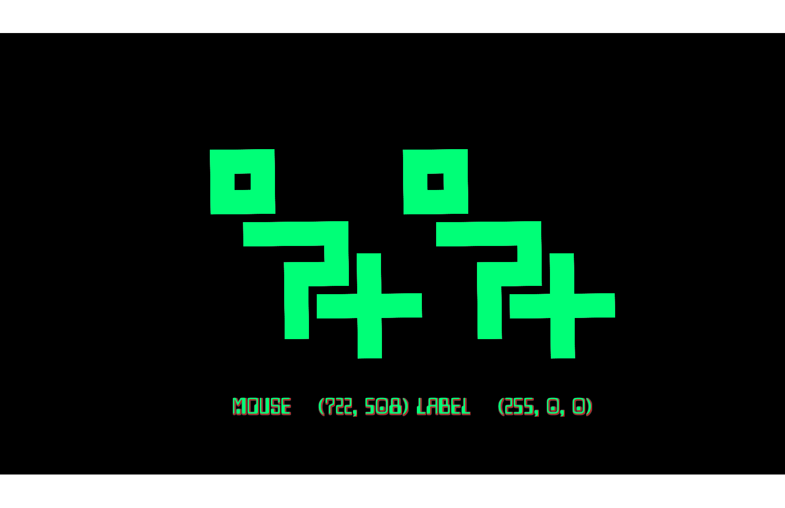
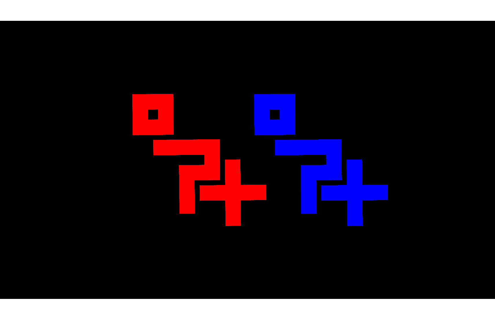

# A simple multiple rendering target demo with orx

This repo provides code in [Label.cpp](src/Label.cpp) and [Object.cpp](src/Object.cpp), and configuration in [orx-mrt-demo.ini](data/config/orx-mrt-demo.ini) that demonstrates one way to use multiple render targets with [the orx game engine](https://orx-project.org/).

## How it works

This demo uses multiple render targets (MRT) to render to both a display target texture and an ID target texture in a single pass. The table below shows an example of each render target, captured from the program by pressing `S` while it is running:

| Display texture                     | ID texture                |
| ----------------------------------- | ------------------------- |
|  |  |

The display texture is what is shown to the user or player. The ID texture can be queried to get pixel-perfect information about which object is rendered at a given location.

### Shader to render to and read from render targets

The shaders for this project are all defined in [config](data/config/orx-mrt-demo.ini).

- `IDShader` outputs to both the display and ID textures in a single offscreen pass.
- `DisplayViewportShader` copies the offscreen display texture to the display viewport so it becomes visible.

[Object.cpp](src/Object.cpp) defines `Object::OnShader`, a callback that provides the ID of the object currently being rendered to the shader. That ID is encoded as an `(R, G, B)` color value and is written to the ID texture, as shown in the table above.
